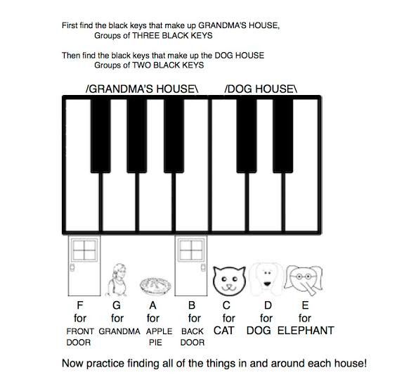
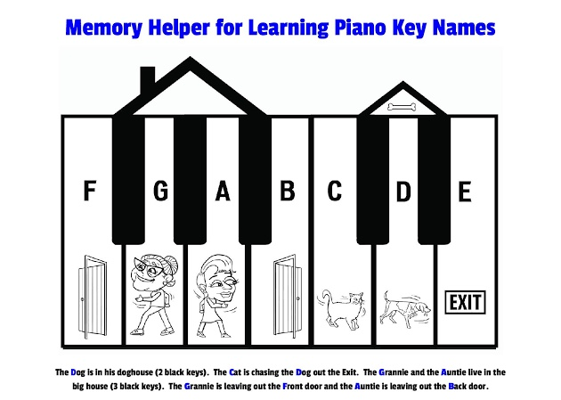

# Description: Familiarise Piano Keys

### Familiarise Piano Keys Using Western Style Notation 
* [Random Note Picker](https://random.bretpimentel.com/)

### Mnemonics to Memorise Keys - Style 1
* Dog lives in the smaller doghouse.
* Dog lives with Cat on left and Elephant on the right.
* Grandmom and Aunt lives in the bigger house.
* Grandmom uses Frontdoor while Aunt uses the Backdoor.
* Memory Cue 1

* Memory Cue 2

* Memory Cue 3

### Mnemonics to Memorise Keys - Style 2
* One scale contains 12 notes - 7 full notes in white keys and 5 half-notes in black keys in between those white keys. 
* The pattern of black and white keys on piano is repeated every 12 notes.
* There are 7 full octaves - 4 up from middle C and 3 down from middle C.
* The C keys are the keys to the LEFT of the '2' black keys.
* The D keys are the keys in the MIDDLE of the '2' black keys.
* The E keys are the keys to the RIGHT of the '2' black keys.
* The F keys are the keys to LEFT of the '3' black keys.
* The G keys are the keys in the MIDDLE of the FIRST TWO of the '3' black keys.
* The A keys are the keys in the MIDDLE of the LAST TWO of the '3' black keys.
* The B keys are the keys to RIGHT of the '3' black keys.
