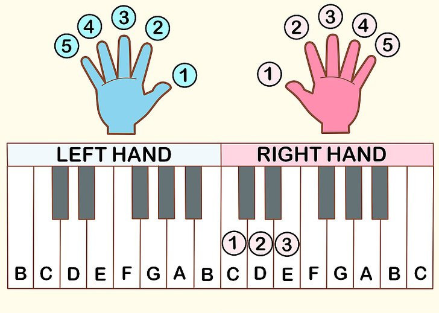

# Description: Alankar or Ornamentation On C Major Scale

### Hands and Fingers Mapping


### Alankar 1
* Right Hand
```
Aaroh   : SA    RE    GA    MA    PA    DHA    NI    SA
Fingers :  1     2     3     1     2      3     4     5

Avaroh  : SA    NI    DHA   PA    MA     GA    RE    SA
Fingers : 5      4      3    2     1      3     2     1
```
* Left Hand
```
Aaroh   : SA    RE    GA    MA    PA    DHA    NI    SA
Fingers :  5     4     3     2     1      3     2     1

Avaroh  : SA    NI    DHA   PA    MA     GA    RE    SA
Fingers : 1      2      3    4     5      3     2     1
```

### Alankar 2
```
Aaroh   : SA    SA    RE    RE    GA      GA    MA    MA    PA    PA    DHA    DHA    NI    NI    SA    SA
Fingers :

Avaroh  : SA    SA    NI    NI    DHA    DHA    PA    PA    MA    MA     GA     GA    RE    RE    SA    SA
Fingers :
```

### Alankar 3
```
Aaroh   : SA-RE-GA      RE-GA-MA     GA-MA-PA    MA-PA-DHA    PA-DHA-NI    DHA-NI-SA
Fingers :

Avaroh  : SA-NI-DHA    NI-DHA-PA    DHA-PA-MA     PA-MA-GA     MA-GA-RE     GA-RE-SA
Fingers :
```

### Alankar 4
```
Aaroh   : SA-RE-GA-MA    RE-GA-MA-PA     GA-MA-PA-DHA    MA-PA-DHA-NI    PA-DHA-NI-SA
Fingers :

Avaroh  : SA-NI-DHA-PA   NI-DHA-PA-MA    DHA-PA-MA-GA     PA-MA-GA-RE     MA-GA-RE-SA
Fingers :
```

### Alankar 5
```
Aaroh   :  SA-RE-SA-RE-GA      RE-GA-RE-GA-MA      GA-MA-GA-MA-PA    MA-PA-MA-PA-DHA    PA-DHA-PA-DHA-NI    DHA-NI-DHA-NI-SA
Fingers :

Avaroh  : SA-NI-SA-NI-DHA    NI-DHA-NI-DHA-PA    DHA-PA-DHA-PA-MA     PA-MA-PA-MA-GA      MA-GA-MA-GA-RE      GA-RE-GA-RE-SA
Fingers :
```

### Alankar 6
```
Aaroh   : SA-RE-GA    SA-RE-GA-MA    RE-GA-MA    RE-GA-MA-PA    GA-MA-PA    GA-MA-PA-DHA    MA-PA-DHA    MA-PA-DHA-NI    PA-DHA-NI    PA-DHA-NI-SA
Fingers :

Avaroh  : SA-NI-DHA-SA-NI-DHA-PA    NI-DHA-PA-NI-DHA-PA-MA    DHA-PA-MA-DHA-PA-MA-GA    PA-MA-GA-PA-MA-GA-RE    MA-GA-RE-MA-GA-RE-SA
Fingers :
```

### Alankar 7
```
Aaroh   : SA-GA    RE-MA    GA-PA    MA-DHA    PA-NI    DHA-SA
Fingers :

Avaroh  : SA-DHA    NI-PA    DHA-MA    PA-GA    MA-RE    GA-SA
Fingers :
```

### Alankar 8
```
Aaroh   : SA-MA    RE-PA    GA-DHA    MA-NI    PA-SA
Fingers :

Avaroh  : SA-PA    NI-MA    DHA-GA    PA-RE    MA-SA
Fingers :
```

### Alankar 9
```
SA 
SA-RE-SA 
SA-RE-GA-RE-SA 
SA-RE-GA-MA-GA-RE-SA 
SA-RE-GA-MA-PA-MA-GA-RE-SA 
SA-RE-GA-MA-PA-DHA-PA-MA-GA-RE-SA 
SA-RE-GA-MA-PA-DHA-NI-DHA-PA-MA-GA-RE-SA 
SA-RE-GA-MA-PA-DHA-NI-SA-NI-DHA-PA-MA-GA-RE-SA
```

### Alankar 10
```
SA
SA-NI-SA
SA-NI-DHA-NI-SA
SA-NI-DHA-PA-DHA-NI-SA
SA-NI-DHA-PA-MA-PA-DHA-NI-SA
SA-NI-DHA-PA-MA-GA-MA-PA-DHA-NI-SA
SA-NI-DHA-PA-MA-GA-RE-GA-MA-PA-DHA-NI-SA
SA-NI-DHA-PA-MA-GA-RE-SA-RE-GA-MA-PA-DHA-NI-SA
```
