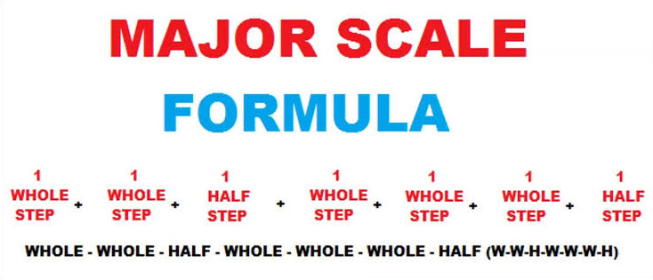

# Description: Major Scale

### Octaves in Indian and Western Notation
```
Indian      : Sa     Re(K)    Re     Ga(K)     Ga     Ma     Pa(K)     Pa     Dha(K)     Dha     Ni(K)     Ni     SA
Western     :  C     C#/Db     D     D#/Eb      E      F     F#/Gb      G      G#/Ab       A     A#/Bb      B      C
```

### Major Scale Formula


### Order to Learn Scales
* C Major Scale - All white keys
* G Major Scale - 1 black key 