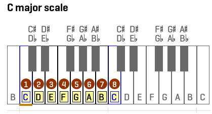
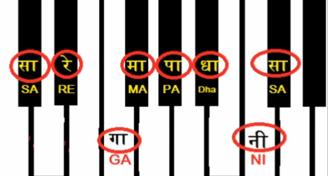
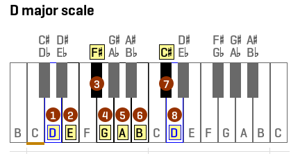

# Description: Major Scale

### Major Scale Formula


### C Major Scale
* Write something here



* Right Hand
```
Aaroh   : SA    RE    GA    MA    PA    DHA    NI    SA
Fingers :  1     2     3     1     2      3     4     5

Avaroh  : SA    NI    DHA   PA    MA     GA    RE    SA
Fingers : 5      4      3    2     1      3     2     1
```

* Left Hand
```
Aaroh   : SA    RE    GA    MA    PA    DHA    NI    SA
Fingers :  5     4     3     2     1      3     2     1

Avaroh  : SA    NI    DHA   PA    MA     GA    RE    SA
Fingers : 1      2      3    1     2      3     4     5
```

### C# / Db Major Scale




* Right Hand
```
Aaroh   : SA    RE    GA    MA    PA    DHA    NI    SA
Fingers :  2     3     1     2     3      4     1     2


Avaroh  : SA    NI    DHA   PA    MA     GA    RE    SA
Fingers : 2      1      4    3     2      1     3     2
```
* Left Hand
```
Aaroh   : SA    RE    GA    MA    PA    DHA    NI    SA
Fingers :  3     2     1     4     3      2     1     2


Avaroh  : SA    NI    DHA   PA    MA     GA    RE    SA
Fingers : 2      1      2    3     4      1     2     3
```

### D Major Scale


* Right Hand
```
Aaroh   : SA       RE    GA(T)    MA    PA    DHA    NI(T)    SA
Fingers :  1        2        3     1     2      3        4     5


Avaroh  : SA    NI(T)      DHA    PA    MA    GA(T)     RE    SA
Fingers : 5         4        3     2     1        3      2     1

```
* Left Hand
```
Aaroh   : SA       RE    GA(T)    MA    PA    DHA    NI(T)    SA
Fingers : 5         4        3     2     1        3      2     1

Avaroh  : SA    NI(T)      DHA    PA    MA    GA(T)     RE    SA
Fingers :  1        2        3     1     2      3        4     5
```

### Eb Major Scale
* Right Hand
```

```
* Left Hand
```

```

### E Major Scale
* Right Hand
```

```
* Left Hand
```

```

### F Major Scale
* Right Hand
```

```
* Left Hand
```

```

### Gb / F# Major Scale
* Right Hand
```

```
* Left Hand
```

```

### G Major Scale
* Right Hand
```

```
* Left Hand
```

```

### Ab Major Scale
* Right Hand
```

```
* Left Hand
```

```

### A Major Scale
* Right Hand
```

```
* Left Hand
```

```

### Bb Major Scale
* Right Hand
```

```
* Left Hand
```

```

### B / Cb Major Scale
* Right Hand
```

```
* Left Hand
```

```
