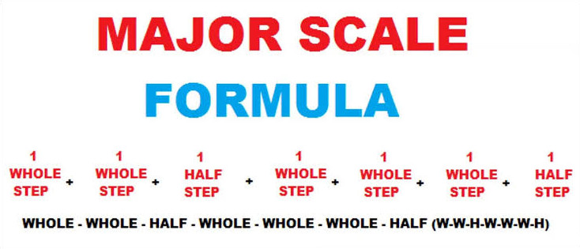

# Description: Major Scale

### Octaves in Indian and Western Notation
```
Indian      : Sa     Re(K)    Re     Ga(K)     Ga     Ma     Pa(K)     Pa     Dha(K)     Dha     Ni(K)     Ni     SA
Western     :  C     C#/Db     D     D#/Eb      E      F     F#/Gb      G      G#/Ab       A     A#/Bb      B      C
```

### Major Scale Formula


### Learning Order
* C Major Scale - 0 black keys
* G Major Scale - 1 black key
* D Major Scale - 2 black key
* A Major Scale - 3 black key
* E Major Scale - 4 black key
* B Major Scale - 5 black key
* F Major Scale - 1 black key
* B Flat Major Scale
* E Flat Major Scale
* A Flat Major Scale
* D Flat Major Scale
* F Sharp or G Flat Major Scale

### Major Scale Table


