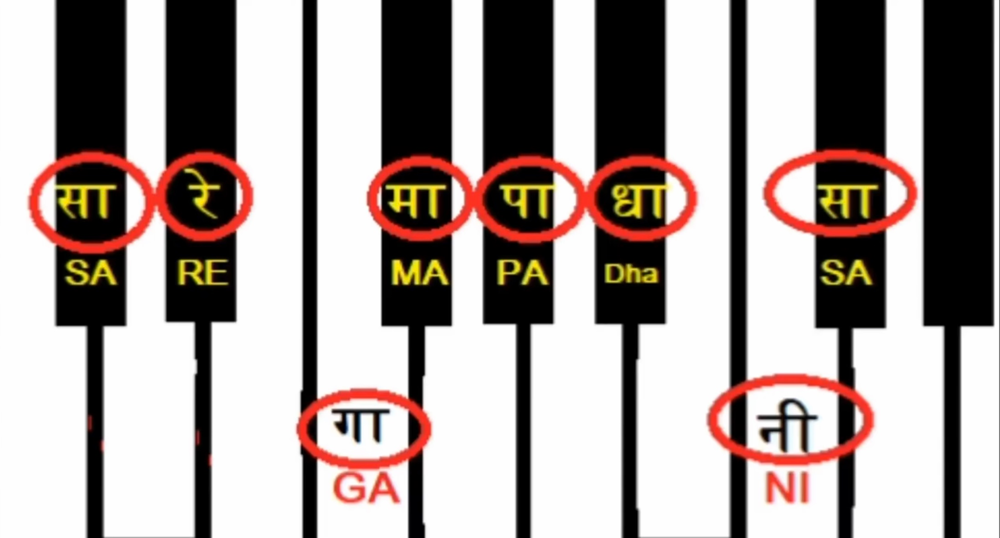

# Description: Alankar or Ornamentation On C# Major Scale

### Alankar On C# Major Scale


### Alankar 1
* Right Hand
```
Aaroh   : SA    RE    GA    MA    PA    DHA    NI    SA
Fingers :  2     3     1     2     3      4     1     2


Avaroh  : SA    NI    DHA   PA    MA     GA    RE    SA
Fingers : 2      1      4    3     2      1     3     2
```
* Left Hand
```
Aaroh   : SA    RE    GA    MA    PA    DHA    NI    SA
Fingers :  3     2     1     4     3      2     1     2


Avaroh  : SA    NI    DHA   PA    MA     GA    RE    SA
Fingers : 2      1      2    3     4      1     2     3
```
