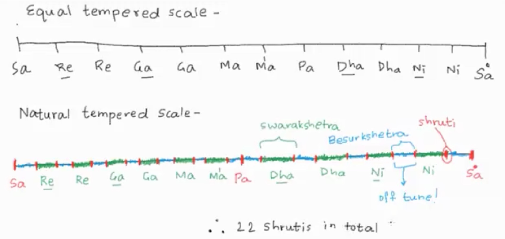

# Description: Hindustani Music

### Introduction
* Branches of Indian Classical Music

* Swaras

* Saptak

* Ek Saptak

* Mandra Saptak, Madhya Saptak and Taar Saptak

* Saptak Variations of Male and Female 

* 22 Shruti
    - Check [22shruti.com](http://22shruti.com/) for more details.

* Vocals in Saptak

* Aaroha and Avroha

### Sounds Classification in Indian Classical Music
