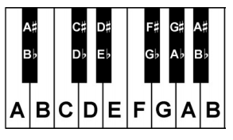

# Description: Piano Keyboard

### Musical Notes
* Musical Notes
    - A musical note (or just a note) is the pitch and duration of a sound. 
    - A note is also its representation in musical notation. Example ♪, ♩ etc.
    - Music notation systems have used letters of the alphabet for centuries. 
    - The seven notes in alphabetical notation are: `A B C D E F G`.
* Solmization 
    - Solmization is a music system of attributing a distinct syllable to each note in a musical scale. 
    - Solfège and Sargam are two such solmization systems.
* Solfège for Western Music
    - Solfège is a music education method used in Western music.
    - Solfège uses 7 notes to make a scale.
    - The seven notes are: `do, re, mi, fa, sol, la, and ti`. It includes sharpened notes of di, ri, fi, si, li and 
      flattened notes of te, le, se, me, ra.
* Sargam for Indian Music
    - Sargam is a solmization system used in Indian music.
    - Sargam uses 7 notes (called swaras) to make a scale.
    - The seven notes are: `Sa, Re, Ga, Ma, Pa, Dha, and Ni`.
    - These seven notes were born out of the words `shadja, rishabh, gandhar, madhyam, pancham, dhaivat and nishad`.
* Musical Notes Vs Solfège Vs Sargam

### Octave
* In music, an octave is the interval between one musical pitch and another with half or double its frequency.
* The most important musical scales are typically written using eight notes, and the interval between the first and last 
  notes is an octave.
* For example, the C major scale is typically written C D E F G A B C, the initial and final Cs being an octave apart.
* There are 12 tones per octave.
* The five tones that are in between the basic seven and are called "half-tones".

### Piano Keyboard

* Keys
    - A modern piano has 52 white keys and 36 black keys for a total of 88 Keys.
    - The black keys are irregularly placed between white keys and are grouped in 3’s and 2’s.
    - There are two black keys then three black keys - then two again - then three and so on.
* Middle C
    - The C4 key is known as the middle C.
    - The tiny black arrow in the keyboard diagrams always indicates MIDDLE C or the C nearest the centre of a piano.
* Octaves
    - There are 4 full octaves up from the middle C (C4).
    - There are 3 full octaves down from the middle C (C4).
    - There are three keys in the "zero" octave at the very low end - `A0 A0# B0`.
    - There is one key in the last octave at the high end - `C8`.

* Sharps or Flats
    - The black keys are known as either SHARPS (#) or FLATS (b).
    - A black key can be a SHARP of the previous white key or FLAT of the next white key.

* 88-Key Piano Keyboard

