# Description: Sheet Music Theory

### References
* [Sheet Music for Beginners](https://www.musicnotes.com/now/tips/how-to-read-sheet-music/)
* [Sheet Music Wikipedia](https://en.wikipedia.org/wiki/Sheet_music)
* [Sheet Music Cheatsheet](https://1.cdn.edl.io/nEOQZcvkRprl94CZsiscvM5GBc8zn9SBVIupGmRJTTAx2S16.pdf)

### Introduction
Sheet music is a music language to represent the pitch, speed, and rhythm of the song. An analogy with English language 
can be to treat notes as the letters, the measures as the words, the phrases as the sentences and so forth.

### The Basic Symbols of Notation
The staff consists of five lines and four spaces. Each of those lines and each of those spaces represents a different 
letter, which in turn represents a note. Those lines and spaces represent notes named A-G, and the note sequence moves 
alphabetically up the staff.

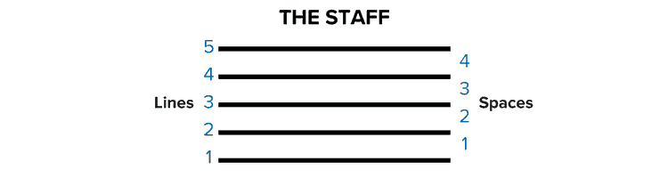

### Treble Clef
There are two main clefs with which to familiarize yourself; the first is a treble clef. The treble clef has the 
ornamental letter G on the far left side. The G’s inner swoop encircles the “G” line on the staff. The treble clef 
notates the higher registers of music, so if your instrument has a higher pitch, such as a flute, violin or saxophone, 
your sheet music is written in the treble clef.  Higher notes on a keyboard also are notated on the treble clef.

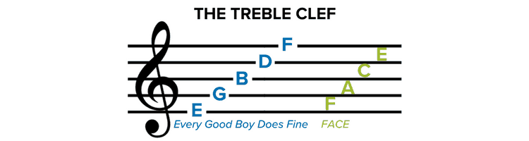

We use common mnemonics to remember the note names for the lines and spaces of the treble clef. For lines, we remember 
EGBDF by the word cue "Every Good Boy Does Fine." Similarly, for the spaces, FACE is just like the word "face."

### Bass Clef
The line between the two bass clef dots is the "F" line on the bass clef staff, and it's also referred to as the F clef. 
The bass clef notates the lower registers of music, so if your instrument has a lower pitch, such as a bassoon, tuba or 
cello, your sheet music is written in the bass clef. Lower notes on your keyboard also are notated in the bass clef.

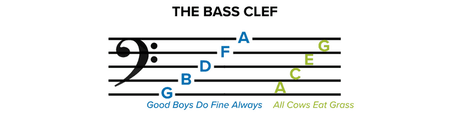

A common mnemonic to remember note names for the lines of the bass clef is: GBDFA "Good Boys Do Fine Always." And for 
the spaces: ACEG, "All Cows Eat Grass."

### Notes
Notes placed on the staff tell us which note letter to play on our instrument and how long to play it. There are three 
parts of each note, the note head, the stem, and the flag.

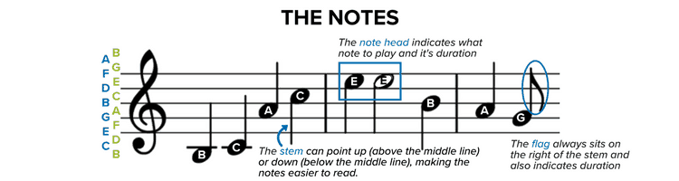

* **Note Head**: Every note has a note head, either filled (black) or open (white). Where the note head sits on the staff 
  (either on a line or space) determines which note you will play. Sometimes, note heads will sit above or below the 
  five lines and four spaces of a staff. In that case, a line (known as a ledger line) is drawn through the note, above 
  the note or below the note head, to indicate the note letter to play, as in the B and C notes above.
* **Note Stem**: The note stem is a thin line that extends either up or down from the note head. The line extends from the 
  right if pointing upward or from the left if pointing downward. The direction of the line doesn't affect how you play 
  the note but serves as a way to make the notes easier to read while allowing them to fit neatly on the staff. As a 
  rule, any notes at or above the B line on the staff have downward pointing stems, those notes below the B line have 
  upward pointing stems.
* **Note Flag**: The note flag is a curvy mark to the right of the note stem. Its purpose is to tell you how long to hold a 
  note. We’ll see below how a single flag shortens the note’s duration, while multiple flags can make it shorter still.

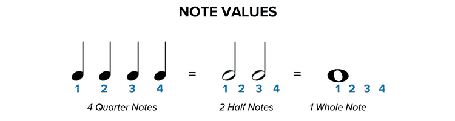

Now that you know the parts to each note, we’ll take a closer look at those filled and open note heads discussed above. 
Whether a note head is filled or open shows us the note's value, or how long that note should be held. Start with a 
closed note head with a stem. That's our quarter note, and it gets one beat. An open note head with a stem is a half 
note, and it gets two beats. An open note that looks like an "o" without a stem is a whole note, and it gets held for 
four beats.

There are other ways to extend the length of a note. A dot after the note head, for example, adds another half of that 
note's duration to it. So, a half note with a dot would equal a half note and a quarter note; a quarter note with a dot 
equals a quarter plus an eighth note. A tie may also be used to extend a note. Two notes tied together should be held as 
long as the value of both of those notes together, and ties are commonly used to signify held notes that cross measures 
or bars.

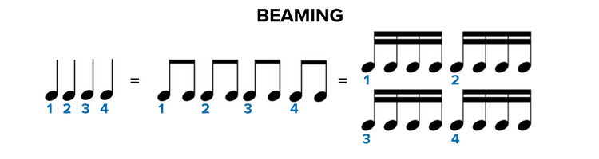

The opposite may also happen, we can shorten the amount of time a note should be held, relative to the quarter note. 
Faster notes are signified with either flags, like the ones discussed above, or with beams between the notes. Each flag
halves the value of a note, so a single flag signifies 1/2 of a quarter note, a double flag halves that to 1/4 of a 
quarter note, etc. Beams do the same while allowing us to read the music more clearly and keep the notation less 
cluttered. As you can see, there’s no difference in how you count the eighth and 16th notes above.

But what happens when there isn’t a note taking up each beat? It’s easy, we take a rest! A rest, just like a note, shows 
us how long it should be held based on its shape.

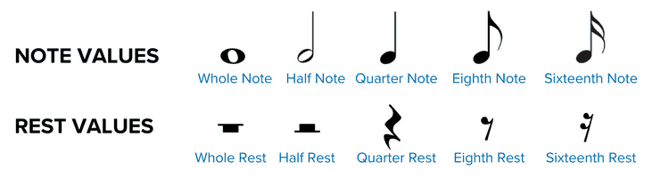

### Pick Up the Beat
To play music, you need to know its meter, the beat you use when dancing, clapping or tapping your foot along with a 
song. When reading music, the meter is presented similar to a fraction, with a top number and a bottom number, we call 
this the song’s time signature. The top number tells you how many beats to a measure, the space of staff in between each 
vertical line (called a bar). The bottom number tells you the note value for a single beat, the pulse your foot taps 
along with while listening.

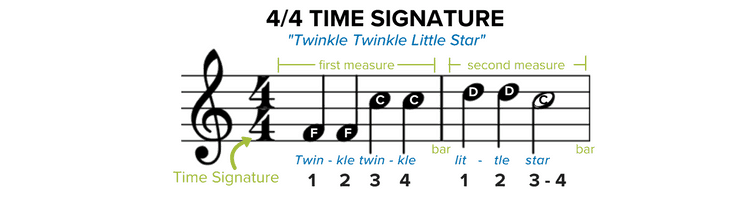

In the example above, the time signature is 4/4, meaning there are 4 beats per bar and that every quarter note gets one 
beat.

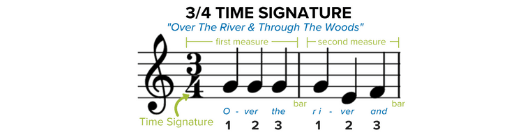

In the example above, the time signature is 3/4, meaning there are 3 beats per bar and that every quarter note gets one beat.

Let's look again at the above examples, notice that even though the 4/4 time signature in "Twinkle, Twinkle Little Star" 
calls for 4 beats per bar, there aren't 4 notes in the second bar? That's because you have two quarter notes and one 
half note, which added together equal 4 beats.

**Tempo** In addition to your note values and time signature, the last piece to feeling the rhythm is knowing your tempo 
or beats per minute. Tempo tells you how fast or slow a piece is intended to be played, and often is shown at the top of 
a piece of sheet music. A tempo of, say 60 BPM (beats per minute) would mean you'd play 60 of the signified notes every 
minute or a single note every second. Likewise, a tempo of 120 would double the speed at 2 notes every second. You may 
also see Italian words like “Largo,” “Allegro” or “Presto” at the top of your sheet music, which signifies common 
tempos. Musicians use a tool, called a metronome, to help them keep tempo while practicing a new piece. 

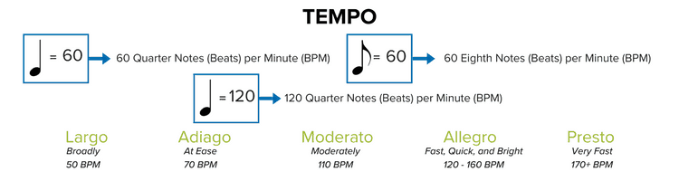

Check [Metronome Online](https://www.metronomeonline.com/): Click on the circles next to the BPM values to see how a 
tempo can speed up and slow down.

### Play a Melody
First, let's look at scales. A scale is made of eight consecutive notes, for example, the C major scale is composed of 
C, D, E, F, G, A, B, C. The interval between the first note of your C major scale and the last is an example of an 
octave. The C major scale is very important to practice since once you have the C scale down, the other major scales 
will start to fall into place. Each of the notes of a C major scale corresponds with a white key on your keyboard. 
Here's how a C major scale looks on a staff and how that corresponds to the keys on your keyboard

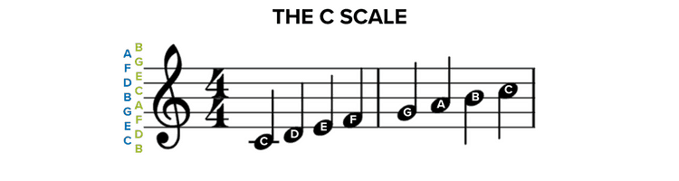

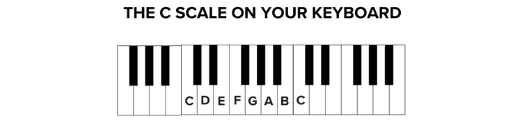

You'll notice that as the notes ascend the staff, and move to the right on your keyboard, the pitch of the notes gets 
higher. But, what about the black keys? Musically, **whole tones**, or whole steps between the note letters, would limit  
the sounds we’re able to produce on our instruments. Let’s consider the C major scale you just learned to play. The  
distance between the C and the D keys in your C scale is a whole step, however, the distance between the E and the F  
keys in your C scale is a half step. Do you see the difference? The E and the F keys don’t have a black key in between  
them, thus they’re just a half step away from one another. Every major scale you’ll play on a keyboard has the same  
pattern, whole-whole-half-whole-whole-whole-half. There are many other types of scales, each with unique sounds, like  
minor scales, modal scales and more that you’ll come across later on, but for now, let’s focus just on major scales and  
the major scale pattern. Look at the C major scale again on the keyboard below.

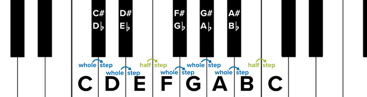

**Semitones**, or half-steps on the keyboard, allow us to write an infinite variety of sounds into music. A sharp, 
denoted by the ♯ symbol, means that note is a semitone (or half step) higher than the note head to its right on sheet 
music. Conversely, a flat, denoted by a ♭ symbol, means the note is a semitone lower than the note head to its right. 
You’ll notice on the keyboard picture and notated staff below, showing each half step between the C and the E notes, 
that whether you use the sharp or the flat of a note depends on whether you’re moving up or down the keyboard.

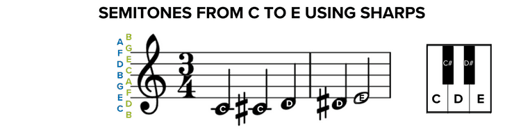

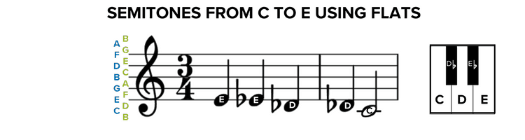

There’s one more symbol to learn regarding semitones, and that’s the **natural**, denoted by a ♮. If a note is sharp or 
flat, that sharp or flat extends throughout the measure, unless there’s a natural symbol. A natural cancels a sharp or 
flat within a measure or a song. Here’s what playing C to E would look like with natural symbols.

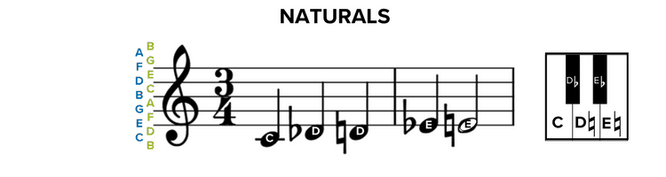

Finally, in order to read music, you’ll need to understand **key signatures**. You actually already know one key 
signature, the key of C! The C major scale you learned above was in the key of C. Scales are named after their tonic, 
the preeminent note within the scale, and the tonic determines what key you play in. You can start a major scale on any 
note, so long as you follow the whole-whole-half-whole-whole-whole-half pattern. Now, following that pattern in keys 
other than the key of C will require you to use sharps and flats. Since that’s the case, we place the sharps or flats 
for your song’s key signature right before the meter, after the clef, on your sheet music. That tells you to maintain 
those sharps or flats throughout the music unless of course there’s a natural symbol to override it. You will begin to 
recognize the key signatures of pieces based on what sharps or flats are shown. Here’s a quick glimpse at some key
signatures using sharps and flats:

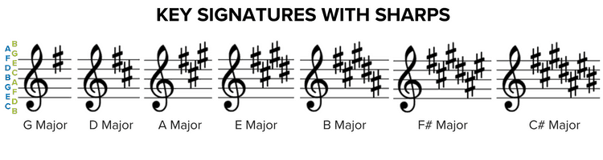

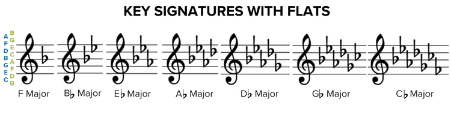

### Sample Sheet Music
* TODO
