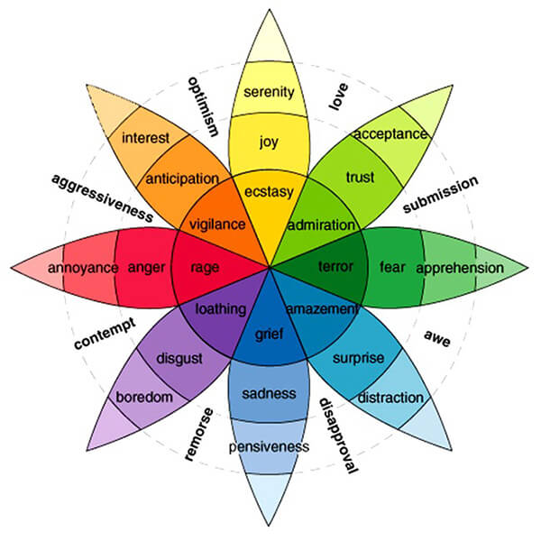

# Description: Music & Emotions

### Comprehending the Complexities of Combined Emotions
They are subtle explanations of how specific base emotions combine to create more complex feelings.

### Musical Key Characteristics
Below is a list of commonly used key, major and minor, along with a succinct version of their emotive expression and 
also include a more verbose explanation so one can really dig deep for what she is looking to get across to her 
listeners. A German music theorist and composer John Mattheson laid it out in his writings way back in 1713, among many 
other related topics. They were rediscovered and translated by Rita Steblin in her book A History of Key Characteristics 
in the 18th and Early 19th Centuries in 1983.

### C MAJOR - Innocently Happy
* Completely pure. Simplicity and naivety. The key of children. Free of burden, full of imagination. Powerful resolve. 
  Earnestness. Can feel religious.

### C MINOR - Innocently Sad, Love-Sick
* Declarations of love and lamenting lost love or unhappy relationships. It is languishing and full of longing, a soul 
  in search of something different.

### C# MINOR - Despair, Wailing, Weeping
* A passionate expression of sorrow and deep grief. Full of penance and self-punishment. An intimate conversation with 
  God about recognition of wrongdoing and atonement.

### Db MAJOR - Grief, Depressive
* Rapture in sadness. A grimacing key of choking back tears. It is capable of a laugh or smile to pacify those around, 
  but the truth is in despair. Fullness of tone, sonority, and euphony.

### D MAJOR - Triumphant, Victorious War-Cries
* Screaming hallelujah's, rejoicing in conquering obstacles. War marches, holiday songs, invitations to join the winning
  team.

### D MINOR - Serious, Pious, Ruminating
* Melancholy, feminine, brooding worries, contemplation of negativity.

### D# MINOR - Deep Distress, Existential Angst
* Dealing with anxiety and existential terror, deep distress, dark depression. The dark night of the soul. Fear, 
  hesitation, shuddering, goose bumps. The language of ghosts.

### Eb MAJOR - Cruel, Hard, Yet Full of Devotion
* Love, Devotion, Intimacy, Openness, Honest Communion. Conversations with God.

### E MAJOR - Quarrelsome, Boisterous, Incomplete Pleasure
* Shouts of Joy, Complete Delight, yet Bickering, Short-fused, Ready to Fight.

### E MINOR - Effeminate, Amorous, Restless
* This key can carry grief, mournfulness, restlessness. Like a princess locked in a tower longing for her rescuer and 
  future lover.

### F MAJOR - Furious, Quick-Tempered, Passing Regret
* Complaisance, Controlled calmness over the readiness to explode. Deeply angry but composed and sociable still. 
  Religious sentiment.

### F MINOR - Obscure, Plaintive, Funereal
* Deepest depression, lament over death and loss, groans of misery, ready to expire. Harrowing. Melancholic.

### F# MAJOR - Conquering Difficulties, Sighs of Relief
* Triumph over evil, obstacles, hurdles. Surmounting foes and finally finding rest in victory. Brilliant clarity of 
  thought and feeling.

### F# MINOR - Gloomy, Passionate Resentment
* Tearing at your hair and shirt, discontentment, long periods of lamentation and crying. Still capable of fighting this
  feeling.

### G MAJOR - Serious, Magnificent, Fantasy
* Rustic, Idyllic, Poetic, Lyrical. Calm and satisfied. Tenderness and Gratitude. Friendship and Faith. It is a gentle 
  key full of peace.

### G MINOR - Discontent, Uneasiness
* Worry of the future, of a failed plan, gnashing of teeth. Concern over a failed plan. Struggling with dislike and 
  malcontent.

### Ab MAJOR - Death, Eternity, Judgement
* Putrefaction, Expansive viewpoints of a dark cosmos and existence. Ghosts, Ghouls, Goblins, Graveyards. Haunting and 
  Lingering.

### Ab MINOR - Grumbling, Moaning, Wailing
* Suffocation of the Heart, Lamentations, Life-Long Struggles. A negative look at the experiences of life, competition, 
  growth.

### A MAJOR - Joyful, Pastoral, Declaration of Love
* Innocent Love, Satisfaction with the current state of affairs. Optimistic. Belief in Heaven and reuniting with lost 
  loved ones. Youthful and cheerful. Trusting in the spirit of the divine.

### A MINOR - Tender, Plaintive, Pious
* Womanly, Graceful in character. Capable of soothing.

### Bb MAJOR - Joyful, Quaint, Cheerful
* Love, Clear Conscience, Hopeful Aspirations for the future and a better world. Optimistic and able to take control in 
  order to ensure peace.

### Bb MINOR - Terrible, the Night, Mocking
* The Garment of Night, Surly, Blasphemous, Turning away the world and the divine. Preparations for the end. Pessimism 
  and giving up. Belief in darkness.

### B MAJOR - Harsh, Strong, Wild, Rage
* Uncontrolled passions. Angry, Jealous, Fury, Despair, Burdened with negative energy. Prepared to fight.

### B MINOR - Solitary, Melancholic, Patience
* The key of patience, calmly waiting for fate, destiny, and the submission to providence and karma.

### Reference
* [Musical Key Characteristics & Emotions](https://ledgernote.com/blog/interesting/musical-key-characteristics-emotions/)