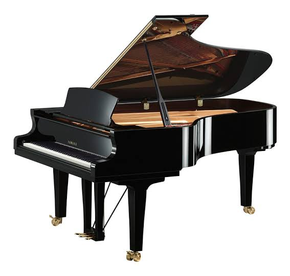
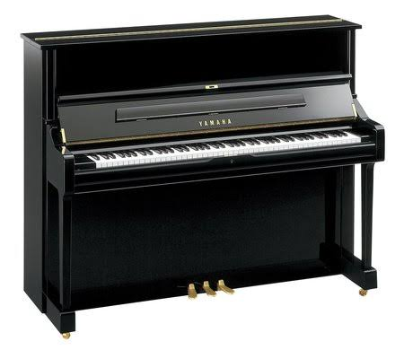

# Description: Piano

### Piano Instrument
* Grand Piano

* Upright Piano

* Parts of Grand Piano

### Keys of a Piano

* Keys
    - A modern piano has 52 white keys and 36 black keys for a total of 88 Keys.
    - The black keys are irregularly placed between white keys and are grouped in 3’s and 2’s.
    - There are two black keys then three black keys - then two again - then three and so on.
* Middle C
    - The C4 key is known as the middle C.
    - The tiny black arrow in the keyboard diagrams always indicates MIDDLE C or the C nearest the centre of a piano.
* Octaves
    - There are 4 full octaves up from the middle C (C4).
    - There are 3 full octaves down from the middle C (C4).
    - There are three keys in the "zero" octave at the very low end - `A0 A0# B0`.
    - There is one key in the last octave at the high end - `C8`.
* Sharps or Flats
    - The black keys are known as either SHARPS (#) or FLATS (b).
    - A black key can be a SHARP of the previous white key or FLAT of the next white key.

* 88-Key Piano Keys

